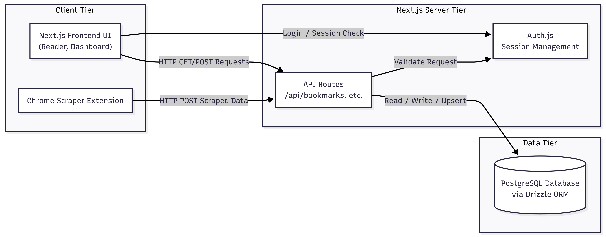
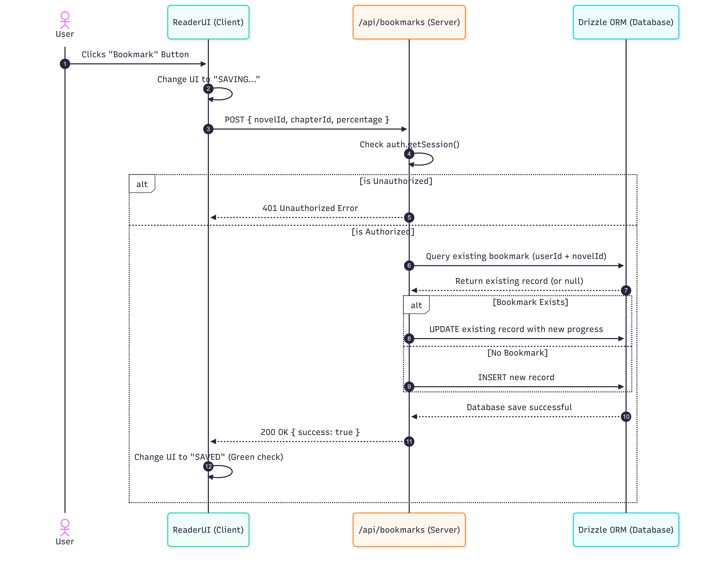

# Web Novel Reader & Scraper

A full-stack web application and companion Chrome extension that allows users to scrape web novels, read them in a custom UI, and securely sync their reading progress.

---

## Running the App Locally

### Prerequisites
Ensure the following are installed:
* **Node.js** (v18 or higher)
* **pnpm** (Performant Node Package Manager)
* **Google Chrome** (required for the scraper extension)
* A **Neon Database** account (for PostgreSQL and Auth)
* **Playwright** (for testing)

### Step 1: Clone and Install Dependencies
Open terminal and run the following commands to download the code and install all required Node packages:
```bash
git clone https://github.com/jiru-shan/wn-reader.git
cd wn-reader
pnpm install
```

### Step 2: Configure Environment Variables
Connect the app to your database and authentication provider. 
1. Create a file named `.env.local` at the root of the directory.
2. Add the following keys and replace the placeholder values with actual Neon project credentials:
```env
DATABASE_URL="XXXXXX"
NEON_AUTH_BASE_URL="XXXXXX"
NEON_AUTH_COOKIE_SECRET="XXXXXX"
```

### Step 3: Setup Database (Drizzle ORM)
Before running the server, ensure the database schema is pushed to your Neon Postgres database. Run the Drizzle command to push your schema (e.g., the `bookmarks` table):
```bash
pnpm drizzle-kit push
```

### Step 4: Start the Next.js Server
With the database connected, start the local development server:
```bash
pnpm dev
```
Go to **[http://localhost:3000](http://localhost:3000)** to see the server running.

### Step 5: Install the Chrome Scraper Extension
The app requires the custom Chrome extension to scrape novel data.
1. Open Google Chrome and type `chrome://extensions/` into the URL bar.
2. Toggle **Developer mode** ON (top right corner).
3. Click the **Load unpacked** button (top left).
4. Select the `extension/` folder located inside the project repository.
5. The extension is now active and ready to communicate with your local Next.js server!

### Step 6: Run tests
Execute Playwright tests using the following command:
```bash
pnpm exec playwright test
```

---

## Key Features

* **Integrated Chrome Scraper:** A custom browser extension that parses novel chapters using offscreen documents and concurrent batch processing.
* **Secure Log in:** A secure login feature that allows novels and userIDs to be stored within a relational database to allow for saving of novels and bookmarks.
* **Distraction-Free Reader UI:** Next.js frontend featuring a dashboard and a dedicated reading interface with formatting options such as font changes, style changes, format changes (long scroll, single page, double page), and more.
* **Bookmarks:** A backend API allows for the manual and automatic storing of reading progress to the database.

---

## System Architecture

### Component Architecture
The diagram below details Client Tier, Server Tier, and Data Tier interaction. The Chrome Extension passes scraped data to the Next.js UI before being saved to the database.



### Sequence Diagram
The diagram below illustrates the exact logic of our `POST /api/bookmarks` route, demonstrating system  authentication and performs an "Upsert" to update a user's reading progress.



---